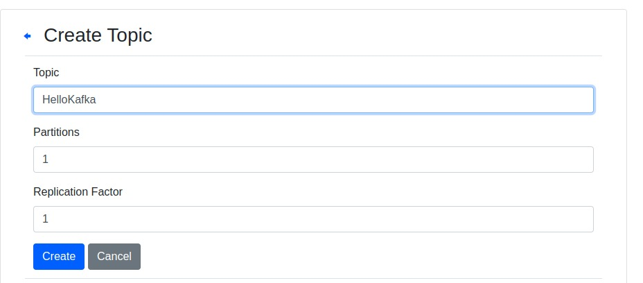

# Kafka Joke Producer and Consumer

This project demonstrates a **Kafka-based** producer-consumer system using **Docker Compose** for easy setup. The producer fetches jokes from the **JokeAPI** and sends them to Kafka, while the consumer reads these jokes from the Kafka topic and prints them.

## Tools Used:
- **Apache Kafka**: Messaging platform.
- **Zookeeper**: Manages Kafka brokers.
- **Kafka Manager**: Web interface to manage Kafka clusters.
- **Python**: For producer and consumer scripts.
- **Docker**: Containerization.


## Setup Instructions

To start the services (Zookeeper, Kafka, Kafka Manager), run the following command:

```bash
docker-compose -f kafka-docker-compose.yaml up -d
```
Once the services are up, configure the Kafka cluster and topics using the Kafka Manager interface.

1-

2-


## Running the Application

Before running the producer or consumer scripts, you must access the Kafka container. Follow these steps:

### 1. **Access the Kafka Container**

To enter the Kafka container's shell, use the following command:

```bash
docker exec -it kafka /bin/bash
```

This allows you to execute the producer and consumer scripts inside the Kafka container.


### 2. **Start the Producer**

Once inside the Kafka container, run this command to start the producer script:

```bash
python3 producer.py
```

The producer fetches jokes from JokeAPI and sends them to the Kafka topic `JokeTest`.


### 3. **Start the Consumer**

In a new terminal window (while the Kafka container is still running), access the container again with the same command:

```bash
docker exec -it kafka /bin/bash
```
Then, run this command to start the consumer script:

```bash
python3 consumer.py
```
The consumer will listen to the `JokeTest` topic and print out the jokes.

## Additional Notes
- Docker and Docker Compose are required to run this project.
- Kafka Manager can be accessed at [http://localhost:9000](http://localhost:9000) for managing topics.
- Make sure to enter the Kafka container using `docker exec -it kafka /bin/bash` before running the producer or consumer scripts.
